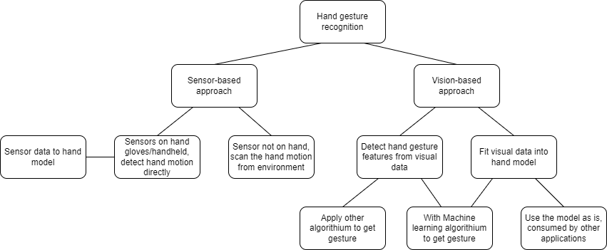

# A survey report on hand gesture recognition technology

Article completion date: 21 Mar 2023

# Index

- [Abstract](#abstract)
- [Introduction](#introduction)
- [Survey details](#survey-details)
- [Conclusion and future work](#conclusion-and-future-work)
- [References](#references)

# Abstract

This survey report discusses two main approaches of hand gesture
recognition, sensor-based and vision-based approaches for their early
development method and recent state-of-the-art methods, as well as to
analyze the advantages and disadvantages of both approaches as well as
their related methods. Some suggestion for future work is also mentioned
at the end of the report.

# Introduction

Hand gesture recognition is an important topic in human-computer
interaction (HCI). It allows the human to commend the computer naturally
by using hand gestures, especially in real-time, and it has many
applications in different fields such as virtual reality, clinical
purpose, sign language, etc. This technology is important as such
naturality feeling is not possible to achieve by using traditional HCI
like a mouse.\[1\] This report aims to provide a general review of this
topic to the public and discuss the two classes of approaches to achieve
hand gesture recognition for both static and dynamic hand gestures, by
using the sensor-based or the vision-based approach, their advantages
and disadvantages, as well as their possible works for future
development.

# Survey details

In the current state, there are mainly two approaches and they are still
the trend of recent research, one of which is using the sensor-based
approach. Different kind of sensors such as gyroscope sensors is
attached to the user’s gloves that are wearied by the user or the sensor
itself is handheld by the user. In this approach, the computer first
collects the sensor data that reflect each part of the hand, and then
analysis and predicts the gesture user is showing. One of the earliest
approaches for hand gesture recognition is the “Sayre Glove” in 1977
\[2\], it is a glove that has multiple light tubes that are flexible and
connected to light sources and light sensors on two ends. When the
user’s fingers move when wearing the glove, the change of light inside
light tubes can be detected by the sensor for the computer to intercept
what gesture it is according to the mapped signal intensity with the
degree of finger bending. Today, the approach on gloves with the
sensor/handheld sensor is quite similar, with different kinds of sensors
applied not limited to light tubes, while the sensor size is much
smaller due to electronic technology improvements over these years.
However, the ways to intercept the sensor data are quite different. From
the above “Sayre Glove”, the sensor signal is directly mapped to hand
motion, but in today's, the feedforward neural network with similarity
matching (FNN/SM) is also applied to estimate the gesture input.\[3\]
The raw data from handheld accelerometer sensors in \[3\] has to pass
through FNN/SM that was trained through input raw data and output
gesture to estimate gesture.

For newer and recent sensor-based approaches, in terms of the sensors,
some methods use sensors to sense and generate the user’s hand raw data
without the presence of gloves or handheld sensors. Two examples are
using infrared light (IR) impulse signals \[4\] and ultrasonic active
sensing \[5\]. Their principle is quite similar, both use signal
emission sources, IR impulse \[4\], and Ultrasound sound \[5\] to emit
signals into the working area (the area the hand is at). The signals
will hit the hand and be reflected back in a pattern according to the
gesture, which is then picked up by the respective receiver sensor. Then
their compute unit can intercept the pattern of the reflected signal to
predict the gesture.

Another approach is using the vision-based approach, which is an
approach being developed later than the sensor-based. This approach does
not attach the sensor to the user’s hand or on their gloves but uses the
camera to capture the user's hand itself and analyze the hand gesture
from the visual input captured. From the visual input, this approach
detects the necessary information and features, which can be including
the pixel group with the specific shape, color, motion of the hand or
even fitting an existing hand model into the hand inside visual input.
This step is mainly to identify what information is about the hand
gesture, and segment the hand out of the visual input. Then the obtained
information will be used to determine what the gesture means to be or
reflect the exact hand model with the gesture to the computer for other
applications’ usage. To analyze the information obtained about the hand
features/model, machine learning algorithms/ other algorithms are used.
Some older examples of machine learning algorithms include hidden Markov
models and finite state machines, while some newer algorithms such as
neural networks, dynamic time warping networks and convolutional neural
networks (CNN) are some state-of-the-art methods for this approach.\[6\]
However, one point worth mentioning is, the features obtained from this
approach and used for the computer to estimate gesture is not
necessarily meaningful to human, this is particularly significant when
using a machine learning algorithm like CNN.

One of the earlier examples to recognize hand gestures is using the
multivariate gaussian distribution and mapping it to the visual image
pixel.\[7\] This method recognized the hand gesture by mapping the hand
inside the image into the formula called multivariate gaussian
distribution function such that the system can get the characteristic of
the gesture from the fitted function. While for a more recent example,
\[8\] applies segmentation and pre-trained CNN to identify hand
gestures. In \[8\] it first segments the hand out from visual input, and
segments the finger out, the data is then further processed such that it
can be input into the pre-trained CNN which can predict the preset class
of pose, like trump-up by analysis hand gesture features from the input
mentioned. While for the hand model fitting method mentioned, a recent
state-of-the-art method call MediaPipe Hands was proposed by Google
\[9\]. In \[9\], the model first uses a pre-trained encoder-decoder
network to extract the hand features called “cropped hand bounding box”
from the input image, then put these features with the image itself,
with hand handedness and hand presence data into the pre-trained
encoder-decoder feature extractor, which can generate a 2.5D model of
the hand with the respective gesture, which can be passed to other
application directly or use to identify the gesture class. Another point
worth mentioning is that the traditional glove/hand-held device output
data can also use to generate a live 2.5D model, like the glove with the
stretch sensor in \[10\].

The below figure a show the overview of approaches on hand gesture
recognition:

<u>Figure a, overview of approaches on hand gesture recognition</u>

In terms of both sensor-based and vision-based approaches, they both
have their advantages and disadvantages to each other.

Regarding to accuracy of both approaches based on their state-of-art
methods, they both have good accuracy. For example, in the non-glove
sensor-based approach, \[5\] that uses ultrasonic active sensing can
achieve an average precision of 96.34%. While for the vision-based
approach, MediaPipe Hands by google at \[9\] achieve an average accuracy
of 95.7%. We can see these two methods has similar accuracy. Even so,
the most traditional sensor-on-hand approach can achieve even higher
accuracy, the handheld accelerometer in \[3\] can even achieve 99.88%
accuracy, even higher than the other two approaches.

On the view of adaptability to different working environments, the
vision-based approach is much less robust when compared to the
sensor-based approach, as the vision-based approach is more likely to be
affected by the environmental condition, one of the examples is in a
dark environment. Since the camera in the vision-based approach is
blacked out at dark environment, the system receives no visual input,
resulting in the disability to predict the hand gesture. However, a dark
environment will not cause the sensor-based system to stop producing
sensor input or disable them to collect data from the user's hand, which
makes them still work in different kinds of conditions.

In the aspect of user comfortability when using the system, the
vision-based approach and non-glove sensor-based approach are better
than the glove sensor-based approach. The lower comfortability of the
gloves/handheld sensor approach is due to the need to wear/handheld the
sensor gloves/sensor to use the system while the non-grove sensor-based
and vision-based approach does not need that. In some intense moving
situations, like hand gesture recognition in virtual reality (VR)
application, the swear from the user's hand can cause discomfort to the
user's hand when wearing gloves. Furthermore, the gloves consisted of
sensors/handheld sensors that cause extra weight on the user’s hand,
which can cause discomfort to them. These discomfort problems will not
happen with the mentioned non-glove approach.

In all of the mentioned methods, the hand model fitting method has the
advantage of generating a hand model with the gesture when compared to
others that generate only a classification result. This ability to
generate the hand model makes it more robust to adapt to different other
applications. For example, the hand gesture model can directly import
into the 3D modeling application to generate a respective virtual model,
or use in the VR application for virtual hand stimulation directly etc.
That is not possible by only generating a classification result. Not at
all, the hand model can also plug into the classifier to classify the
gesture type as other methods. That is, the hand model fitting method
has better adaptability to different other applications compared to
other methods due to its ability to provide the actual hand gesture data
inside the hand model.

Below table a shows overall comparison of different approaches and
methods.

<table>
<colgroup>
<col style="width: 22%" />
<col style="width: 26%" />
<col style="width: 17%" />
<col style="width: 15%" />
<col style="width: 18%" />
</colgroup>
<thead>
<tr class="header">
<th colspan="5">Approach and methods</th>
</tr>
</thead>
<tbody>
<tr class="odd">
<td></td>
<td>Glove/hand-held Sensor-based</td>
<td>Non-glove sensor-based</td>
<td>
Vision-approach

gesture classification
</td>
<td>
Vision-approach

Generate hand gesture model
</td>
</tr>
<tr class="even">
<td>Accuracy</td>
<td>Very high</td>
<td colspan="3">High</td>
</tr>
<tr class="odd">
<td>User’s comfortability</td>
<td>Lower, need to wear glove/handheld sensor</td>
<td colspan="3">High, user use bare hand</td>
</tr>
<tr class="even">
<td>Adaptability to working environment</td>
<td colspan="2">Robust to different environments</td>
<td colspan="2">Do not work in some environment, i.e., dark
environment</td>
</tr>
<tr class="odd">
<td>Adaptability to other application</td>
<td>Can be use to generate model, cause good adaptability</td>
<td colspan="2">Only provide a classification result, can only be ported
to less applications</td>
<td>Hand model can adapt to variety of applications</td>
</tr>
</tbody>
</table>

<u>Table a, overall comparison of different approaches and methods</u>

# Conclusion and future work

Generally, in today's state-of-the-art methods, hand gesture recognition
has high accuracy and is already in the practical state. Both approaches
mentioned have their advantages and disadvantages and are still the
focused research area. For practical purposes, which approaches to use
should depend on the actual situation with the characteristic of
respective approaches.

One of the future works is to study the performance of these methods in
actual working environments to understand do they really have high
accuracy, as well as usability in the actual practical situations.
Because many methods published by the paper aforementioned only have the
accuracy results based on the laboratory environment, the accuracy in
the practical environment is still unclear. Also, new research can also
focus to improve the user’s comfortability on glove/hand-held
Sensor-based approach. Furthermore, on the vision-based approach, future
research can also discover how to improve the adaptability to different
working environments, like in dark conditions, using the light vision
camera instead of the normal camera for visual input. Lastly, future
research can also focus on to further increasing gesture recognition
accuracy on all approaches.

# References

\[1\] A. Chaudhary, J. L. Raheja, K. Das, and S. Raheja, “Intelligent
Approaches to interact with Machines using Hand Gesture Recognition in
Natural way: A Survey,” *International Journal of Computer Science &
Engineering Survey*, vol. 2, no. 1, pp. 122–133, Feb. 2011, doi:
https://doi.org/10.5121/ijcses.2011.2109.

‌\[2\] L. Dipietro, A. M. Sabatini and P. Dario, "A Survey of Glove-Based
Systems and Their Applications," in *IEEE Transactions on Systems, Man,
and Cybernetics, Part C (Applications and Reviews)*, vol. 38, no. 4, pp.
461-482, July 2008, doi: 10.1109/TSMCC.2008.923862.

\[3\] R. Xie and J. Cao, "Accelerometer-Based Hand Gesture Recognition
by Neural Network and Similarity Matching," in *IEEE Sensors Journal*,
vol. 16, no. 11, pp. 4537-4545, June1, 2016, doi:
10.1109/JSEN.2016.2546942.

\[4\] T. J. Daim and R. M. A. Lee, "Hand Gesture Speed Recognition and
Classification using IR-UWB Radar Sensor," *2022 IEEE 18th International
Colloquium on Signal Processing & Applications (CSPA)*, Selangor,
Malaysia, 2022, pp. 41-45, doi: 10.1109/CSPA55076.2022.9782018.

\[5\] Y. Sang, L. Shi and Y. Liu, "Micro Hand Gesture Recognition System
Using Ultrasonic Active Sensing," in *IEEE Access*, vol. 6, pp.
49339-49347, 2018, doi: 10.1109/ACCESS.2018.2868268.

\[6\] Al Farid, F. *et al.* (2022) “A structured and methodological
review on vision-based hand gesture recognition system,” *Journal of
Imaging*, 8(6), p. 153. Available at:
https://doi.org/10.3390/jimaging8060153.

\[7\] Hasan, M.M. and Mishra, P.K. (2012) “Robust gesture recognition
using gaussian distribution for features fitting,” *International
Journal of Machine Learning and Computing*, pp. 266–273. Available at:
https://doi.org/10.7763/ijmlc.2012.v2.128.

\[8\] Neethu, P.S., Suguna, R. and Sathish, D. (2020) “An efficient
method for human hand gesture detection and recognition using deep
learning convolutional neural networks,” *Soft Computing*, 24(20), pp.
15239–15248. Available at: https://doi.org/10.1007/s00500-020-04860-5.

\[9\] Zhang, F. *et al.* (2020) *MediaPipe hands: On-device real-time
hand tracking*, *arXiv.org*. Google Research. Available at:
https://arxiv.org/abs/2006.10214 (Accessed: March 21, 2023).

\[10\] Glauser, O. *et al.* (2019) “Interactive hand pose estimation
using a stretch-sensing soft glove,” *ACM Transactions on Graphics*,
38(4), pp. 1–15. Available at: https://doi.org/10.1145/3306346.3322957.
